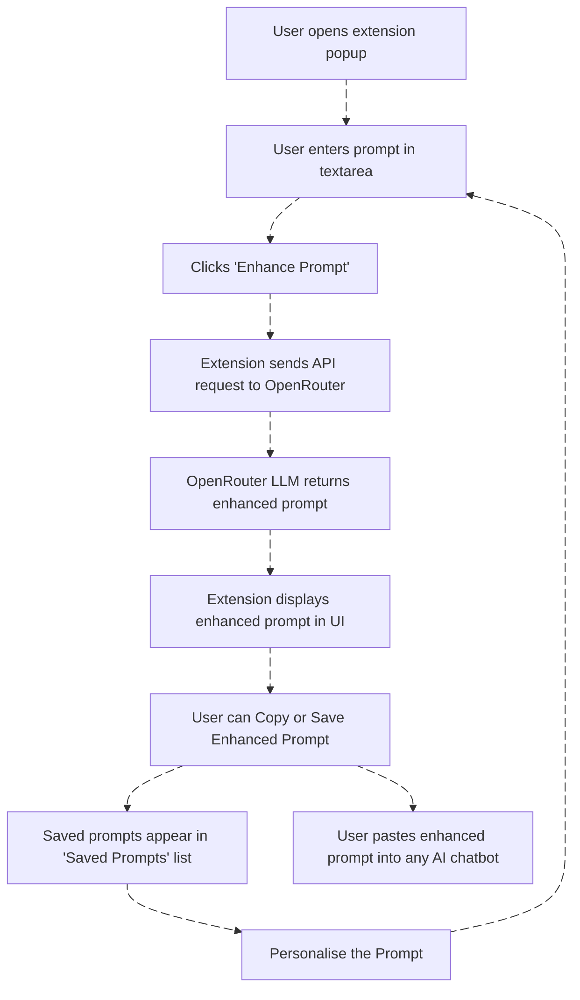

<div align="center">

## Prompt Perfect Local

A Chrome extension for enhancing and organizing AI prompts, designed to work locally without any server dependencies.

</div>

<div align="center">
  
[](https://skillicons.dev)

</div>

---

## ⚡ Features

- **Prompt Enhancement**: Instantly rewrite and optimize your prompts for better AI responses using best practices
- **Prompt Library**: Save, organize, and reuse your favorite enhanced prompts
- **Context Menu Integration**: Right-click in any text field to enhance or save prompts
- **Local Storage**: All prompts are stored locally in your browser
- **Stateless Enhancement**: Every enhancement is a new, independent task—no chat history or context is used
- **No Chatbot Integration**: You manually copy the enhanced prompt and paste it into any AI chatbot of your choice

---

## 💻 Installation

1. Download or clone this repository to your local machine
2. Create an `openrouter_secrets.js` file in the extension root with your OpenRouter API key:

   ```js
   window.OPENROUTER_API_KEY = 'sk-...'; // Your OpenRouter API key
   ```
   (This file should be gitignored and never shared.)
4. Open Chrome and navigate to `chrome://extensions/`
5. Enable **Developer mode** in the top right corner
6. Click **Load unpacked** and select the extension directory
7. The extension icon should appear in your Chrome toolbar

---
## 👀 Usage

### Basic Usage

1. Click the **Extension Icon** to open the popup
2. Enter your **Raw prompt** in the text area
3. Click **Enhance Prompt** to generate an improved version
4. Use **Save Enhanced Prompt** to store the enhanced prompt for later use
5. Use **Copy to Clipboard** to copy only the enhanced prompt to be used on ChatBots like ChatGPT, Claude, Google Bard and more
6. Saved prompts appear under **Saved Prompts** for easy reuse

### Prompt Library

- Saved prompts are shown in the popup under **Saved Prompts**
- Click any saved prompt to load it into the input area
- Edit and enhance as needed
- Prompts are stored locally and are not used for anything else

---
## 🔗 API Integration (Required)

For enhanced features, you **must** add your OpenRouter API key in `openrouter_secrets.js`:

1. Get an API key from [OpenRouter](https://openrouter.ai/)
2. Create a file named `openrouter_secrets.js` in the extension root:

   ```js
   window.OPENROUTER_API_KEY = 'sk-...';
   ```
   (This file should be gitignored and never shared.)
4. Reload the extension in Chrome.

**Optional:** Run a different model of choice

1. Choose your own [Model](https://openrouter.ai/models?max_price=0) from the free models available on OpenRouter.
2. Copy the model name and replace it in the `popup.js` file.


   ```
   Other free `$models` to choose from:
   mistralai/mistral-7b-instruct:free
   meta-llama/llama-3.3-8b-instruct:free
   meta-llama/llama-4-maverick:free
   microsoft/phi-4-reasoning:free
   nvidia/llama-3.1-nemotron-ultra-253b-v1:free
   ```
3. Reload the extension on Chrome.

---
## ⚙ How It Works



---
## 🛠 Development

### Project Structure

```
/prompt-perfect-local-extension/
│
├── manifest.json              # Extension metadata
├── background.js              # Background tasks and context menu
├── content.js                 # Context menu and input integration
├── popup.html                 # Main popup interface
├── popup.js                   # Popup logic
├── style.css                  # Shared styles
├── openrouter_secrets.js      # (Not committed) OpenRouter API key
└── icons/                     # Extension icons
```

### Local Development

1. Make changes to the source files
2. Go to `chrome://extensions/`
3. Click the refresh icon on the extension card
4. Test your changes

### Testing

- Test the extension on [Postman](https://www.postman.com/) by importing the cURL.

```curl
curl https://openrouter.ai/api/v1/chat/completions \
  -H "Content-Type: application/json" \
  -H "Authorization: Bearer $OPENROUTER_API_KEY" \
  -d '{
  "model": "$model",
  "messages": [
    {
      "role": "system",
      "content": "You are a professional Prompt Engineer........[entire system prompt]."
    },
    {
      "role": "user",
      "content": "What is the meaning of life?"
    }
  ]
  
}'
```
- Try using different prompts for `user` role and `model`
- Verify all features work with your API key in `openrouter_secrets.js`
- Check that enhanced prompts are properly saved and retrieved

---
## 👮🏻‍♂️ Security

- No data is sent to external servers (except when using OpenRouter API)
- All prompts are stored locally in your browser
- API keys are stored only in your local `openrouter_secrets.js` file
- No tracking or analytics

---
## 🙄 Limitations

- Works only in Chrome/Chromium-based browsers
- Requires manual installation (not available in Chrome Web Store)
- An OpenRouter API key is required for all enhancement features
- If you disable or delete the extension, the saved Prompts are lost

---
## 👨‍👨‍👧‍👦 Contributing

1. Fork the repository
2. Create a feature branch
3. Make your changes
4. Test thoroughly
5. Submit a pull request

---
## 😉 Acknowledgments

- Inspired by the original Paid [Prompt Perfect chrome extension](https://chromewebstore.google.com/detail/prompt-perfect-ai-prompt/kigfbkddbfgbdbdekajodpggpkpfdjfp)
- Built with vanilla JavaScript for maximum compatibility
- Uses Chrome Extension Manifest V3
- Implements modern web standards and best practices

---

**Made with ❤️ by [Brian Castelino](https://github.com/bcastelino)** 
